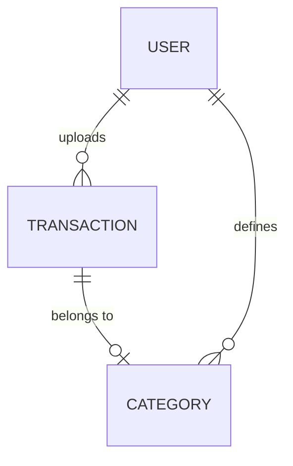

# Entity Model

This document outlines the core data structures used in the Peppermint POC.

## 1. Transaction Entity

The primary unit of data in the system.

| Field         | Type      | Description                                                     |
| :------------ | :-------- | :-------------------------------------------------------------- |
| `id`          | `uuid`    | Unique identifier for the transaction.                          |
| `date`        | `ISO8601` | When the transaction occurred.                                  |
| `description` | `string`  | Raw merchant description from the bank/CSV.                     |
| `amount`      | `decimal` | Transaction amount (negative for expense, positive for income). |
| `currency`    | `string`  | 3-letter currency code (e.g., USD, CAD).                        |
| `categoryId`  | `uuid?`   | Link to the Category entity.                                    |
| `status`      | `enum`    | `auto-categorized`, `manual-override`, `pending-ai`.            |
| `metadata`    | `JSON`    | Stores raw CSV row data or bank-specific info.                  |

## 2. Category Entity

Used for grouping transactions and generating reports.

| Field      | Type       | Description                                               |
| :--------- | :--------- | :-------------------------------------------------------- |
| `id`       | `uuid`     | Unique identifier.                                        |
| `name`     | `string`   | Display name (e.g., "Dining Out", "Rent").                |
| `icon`     | `string`   | Lucide icon name or emoji.                                |
| `color`    | `string`   | Hex code for UI representation.                           |
| `keywords` | `string[]` | Heuristic matching rules (e.g., ["Starbucks", "Dunkin"]). |

## 3. User Configuration (Mocked)

Minimal settings for the POC.

| Field          | Type         | Description                            |
| :------------- | :----------- | :------------------------------------- |
| `baseCurrency` | `string`     | User's preferred currency for charts.  |
| `categories`   | `Category[]` | Custom categories defined by the user. |

## Data Flow / Relationships

## AI Consideration

The `status` field in the `Transaction` entity tracks whether the AI has processed the transaction.

- **Tier 1**: Keyword check (updates `categoryId` and sets status to `auto-categorized`).
- **Tier 2**: Async LLM call (sets status to `pending-ai` then updates once returned).
